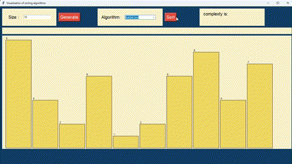

## Algorithm vizualization Project
This repository contains implementations of various sorting algorithms. Each algorithm is implemented in Python and includes:

Bubble Sort (bubbleSort.py)

Insertion Sort (insertionSort.py)
Selection Sort (selectionSort.py)
Quick Sort (quickSort.py)
Sorting Algorithm Visualization (sorting_algoritm_visualization.py)
These scripts demonstrate fundamental sorting techniques and include a visualization script to help understand how these algorithms work.
