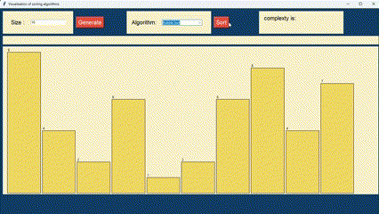
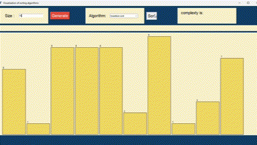
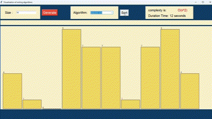
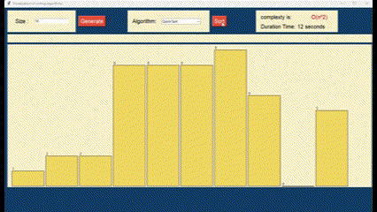

# Algorithm vizualization Project</h1>
This repository contains implementations of various sorting algorithms. Each algorithm is implemented in Python and includes:

- **Bubble Sort** (bubbleSort.py)
- 

- **Insertion Sort** (insertionSort.py)</h2> 
- 

- **Selection Sort** (selectionSort.py)</h2> 
- 

- **Quick Sort** (quickSort.py)</h2>
- 

Sorting Algorithm Visualization (sorting_algoritm_visualization.py)
These scripts demonstrate fundamental sorting techniques and include a visualization script to help understand how these algorithms work.
